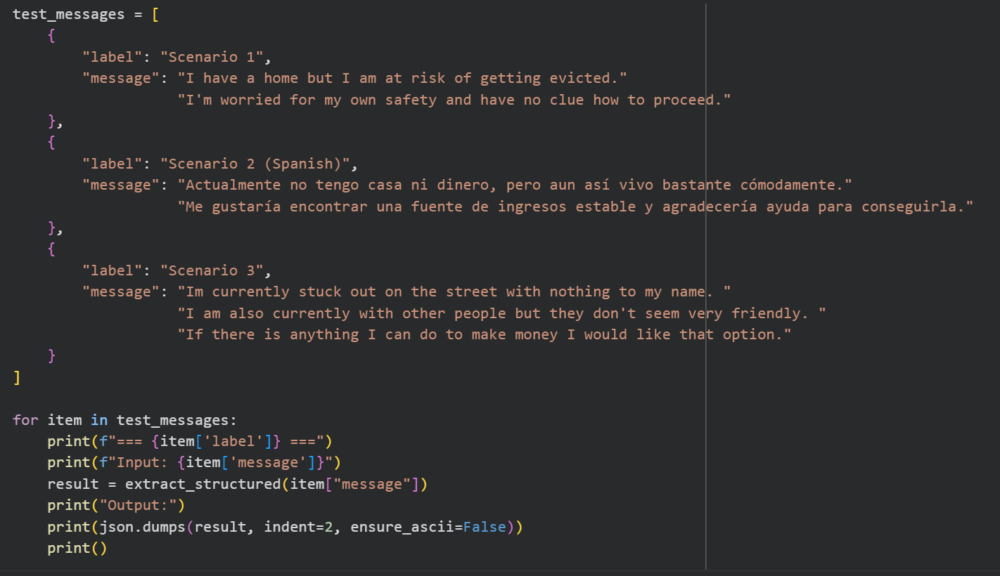
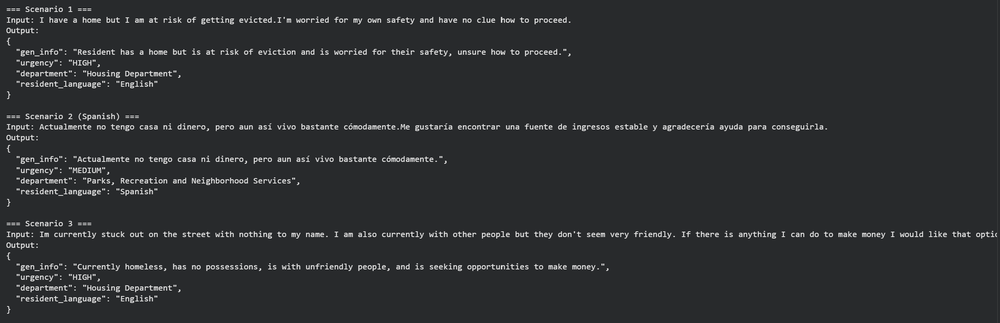

# ai-for-social-good-project
ai based project that takes in caller messages and outputs responses using ai
## Problem — Who is affected, and what specifically breaks down for them today?
This is a prototype for residents of San Jose (CA) who do not have a permanent residence and/or stable employment and are experiencing any of the following challenges: (1) difficulty communicating clearly about their need for assistance; (2) cannot provide enough detail about their needs because they do not have a way to write (like a pen); and/or (3) have contacted someone in the past for help but do not remember how that person was able to help them. Because most residents that are in some type of unstable housing situation do not have the time, ability to get to a location, phone access, or confidence to reach out to multiple entities for assistance, it is imperative that we create a system that is structured so that each person who contacts the City of San Jose has their inquiry evaluated and assigned in accordance with a standard (e.g., “San Jose-style” Civic Intake Process) for all requests that go through the Civic Intake System. Thus, as soon as a resident or caller contacts someone at the City or Agency of San Jose, the City or Agency must obtain enough information from the resident/caller to determine how serious the issue is and what level of urgency it has so they can assign the appropriate person to respond to the inquiry and/or provide the service requested.

## AI Capability — Which lab capability addresses the failure point, and why does it fit?
By using a generative AI model to create responses in multiple languages and pull structured information from them, the prototype directly addresses this failure point. The problem isn’t just translating/understand a request written in one language into the appropriate written language (e.g., from English to Spanish); it is also converting what may have been an incredibly difficult, messy, or unrecognizable request written in natural language (English) to accepted and understood fields (e.g., how do you currently live? what’s the level of urgency? which department should we contact?), within our hypothetical case study above, that can then be inserted into the system. Data from the lab indicate that the model can both identify the language being used in a test message and respond in that same language in all three languages tested (i.e., Spanish, Vietnamese, and Cantonese). Second, the lab data also indicate that the model can take very short housing related messages and convert them into structured JSON with the required fields of general information, urgency, department, and language; thus making it useful as an initial triage assistant, but not the final decision maker.  
## Workflow — What goes in, what does the AI do, what comes out, and who acts on the output? Include screenshots of output
This consists of an automated way to receive resident messages by telephone as recorded on voicemail. Messages include description of housing status; income/resources; safety concerns; whether rejected offer of employment or need for housing assistance. AI will first identify phone caller's language, generate a short acknowledgment in their language and extract information into reportable fields (general situation; urgency of situation; appropriate department; the caller's language).

This will result in a triage report (formatted as a JSON structure) and the potential acknowledgment to the resident. Staff person who intakes this case (e.g., a human) will use this report to determine appropriate urgency level and department for forwarding. AI will not assign services but will enable staff to quickly respond with more detailed information.

## Failure Case — One specific failure, with a reference to the lab output that showed it is possible.
There was one failure in Scenario 2's completion of the Spanish test where a resident stated that they were currently homeless and out of money and requested assistance to find a stable source of income. The AI was able to identify that Spanish was spoken and has an understanding of the context of the request and was able to summarize the core issues, but it routed the request to "Parks, Recreation and Neighborhood Services" rather than to the appropriate department dealing with homelessness, income instability, and employment support. This is significant to the individual who will either be delayed in having their needs met or sent to an erroneous department because their communication indicates need at a high level. In the figure below the failure in the prototype output can be seen to be most significantly related to the department field within the model.

## Oversight and Tradeoff — Where does human review sit, and what does the one change cost?
After AI generates a structured triage record for the case, a human will review the record and determine whether or not it is appropriate to proceed with routing the case. The reviewer will ensure that the urgency level and department assigned to the case match the actual situation. This determination is made using a number of factors, including whether someone is at risk of losing their housing; whether someone is at risk of harm; whether people have called into make requests on others' behalf; and whether there are multilingual requests present in the record. AI helps expedite this process of determining how to sort case records. However, the human reviewer is ultimately responsible for the decision about how to route the record. One modification of the current process involves creating a list of approved routing options for the routing model to use when routing records associated with housing. Approved routing options would include Housing Division, Homelessness Services, Employment Support, Emergency/Safety Support, and Benefits Navigation. The model will not have the ability to generate or choose any department for a routing option, resulting in less flexibility for routing records with unique or uncommon circumstances manually; however, individuals with high-priority housing or income-related cases are less likely to be routed incorrectly to a department that does not provide appropriate services to resolve their situation.

